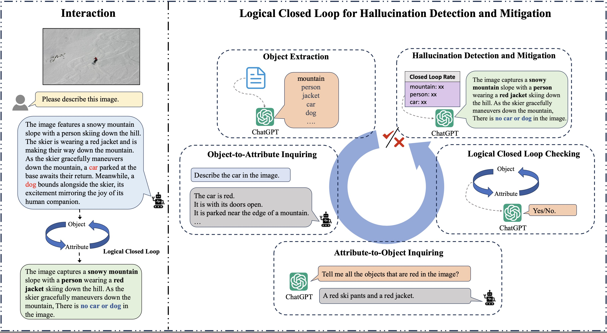

# Logical Closed Loop: Uncovering Object Hallucinations in Large Vision-Language Models


<!-- <div align="center"> -->
[](https://arxiv.org/pdf/2402.11622.pdf)
[](https://opensource.org/licenses/MIT)
<!-- </div> -->

Source code for the ACL 2024 paper "Logical Closed Loop: Uncovering Object Hallucinations in Large Vision-Language Models". We are the first to detect and mitigate object hallucinations in LVLMs by themselves through logical closed loops.

## Overview

<p align="center">
    
</p>

> Object hallucination has been an Achilles’ heel which hinders the broader applications of large vision-language models (LVLMs). Object hallucination refers to the phenomenon that the LVLMs claim non-existent objects in the image. To mitigate the object hallucinations, instruction tuning and external model-based detection methods have been proposed, which either require large-scare computational resources or depend on the detection result of external models. However, there remains an under-explored field to utilize the LVLM itself to alleviate object hallucinations. In this work, we adopt the intuition that the LVLM tends to respond logically consistently for existent objects but inconsistently for hallucinated objects. Therefore, we propose a Logical Closed Loop-based framework for Object Hallucination Detection and Mitigation, namely LogicCheckGPT. In specific, we devise logical consistency probing to raise questions with logical correlations, inquiring about attributes from objects and vice versa. Whether their responses can form a logical closed loop serves as an indicator of object hallucination. As a plug-and-play method, it can be seamlessly applied to all existing LVLMs. Comprehensive experiments conducted on three benchmarks across four LVLMs have demonstrated significant improvements brought by our method, indicating its effectiveness and generality.


## Requirements

1. Create environment
- You can set up the environment for running code in this repository. The `environment.yml` file supports mPLUG-Owl, MiniGPT4, and QWEN-VL-Chat.
```
conda env create -f environment.yml
conda activate LogicCheckGPT
```

- For LLaVA, we follow the offical guidance provided by [LLaVA](https://github.com/haotian-liu/LLaVA) when setting the environment. Additionally, the installation of the `Spacy` and `OpenAI` packages is required.


2. Install required spacy model
```
python -m spacy download en_core_web_lg
```


## Data
We utilize three widely used evaluations.
- **POPE**: The sampled 300 questions under each settings are in the `./dataset/coco50` folder. You should also download validation set of COCO 2014 on [coco](https://cocodataset.org/#download).
- **MME Existence** Subset: You can refer [MME](https://github.com/BradyFU/Awesome-Multimodal-Large-Language-Models/tree/Evaluation) to obtain the benchmark dataset. 
- **GPT4v-assisted Evaluation**: The sampled 50 images are listed in `./dataset/gpt4v_evaluation.txt`. And the question is in the format "Please describe this image in detail."


## Usage

For different LVLMs, begin by preparing the project or checkpoints, and then execute the respective Python file::
- **mPLUG-Owl**  (`./logiccheckgpt/check_mplug.py`)
    1. Clone the [project](https://github.com/X-PLUG/mPLUG-Owl) and specify it at Line 16.
    2. Download the checkpoint [mplug-owl-llama-7b](https://huggingface.co/MAGAer13/mplug-owl-llama-7b) and specify it at Line 22 variable`pretrained_ckpt`.
    3. Specify the openai.api_key and data path.
    4. Run `./logiccheckgpt/check_mplug.py`.
    5. Finally, execute the evaluation script in `./evaluate/` to calculate the metrics.
- **LLaVA-1.5** (`./logiccheckgpt/check_llava.py`)
    1. Clone the [project](https://github.com/haotian-liu/LLaVA) and specify it at Line 16
    2. Download the checkpoint [llava-v1.5-7b](https://huggingface.co/liuhaotian/llava-v1.5-7b) and specify it at Line 35 variable`model_path`.
    3. Specify the openai.api_key and data path.
    4. Run `./logiccheckgpt/check_llava.py`.
    5. Finally, execute the evaluation script in `./evaluate/` to calculate the metrics.
    
**Note**:

- In this repository, we offer the code utilizing GPT-3.5-turbo-0125 instead of the previously mentioned GPT-3.5-turbo, chosen for its remarkable cost-effectiveness. Nevertheless, through our verification process, we have confirmed their performances are close.
- In addition, we have conducted initial experiments by replacing GPT with Vicuna-13b-v.15 to verify the flexibility of our framework. LogicCheckGPT implemented by Vicuna exhibits strong performance across the four LVLMs, surpassing all other baseline methods. Our method retains the flexibility to substitute GPT with alternative methods tailored to each step.


## Citation
If you find this repo useful, please consider citing:
```
@article{wu2024logical,
      title={Logical Closed Loop: Uncovering Object Hallucinations in Large Vision-Language Models}, 
      author={Junfei Wu and Qiang Liu and Ding Wang and Jinghao Zhang and Shu Wu and Liang Wang and Tieniu Tan},
      journal={arXiv preprint arXiv:2402.11622},
      year={2024},
}
```

## Acknowledgment
- [mPLUG-Owl](https://github.com/X-PLUG/mPLUG-Owl/tree/main/mPLUG-Owl)
- [MiniGPT-4](https://github.com/Vision-CAIR/MiniGPT-4)
- [LLaVA](https://github.com/haotian-liu/LLaVA)
- [QWEN-VL](https://github.com/QwenLM/Qwen-VL)
- [Woodpecker](https://github.com/BradyFU/Woodpecker)

We thank them for their great contribution to the research community of LVLMs.
